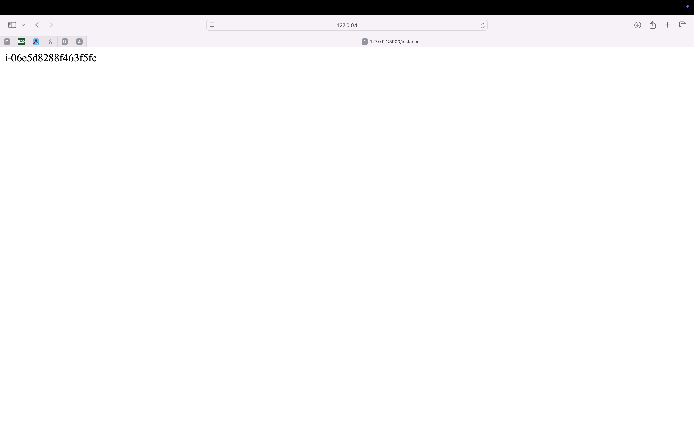
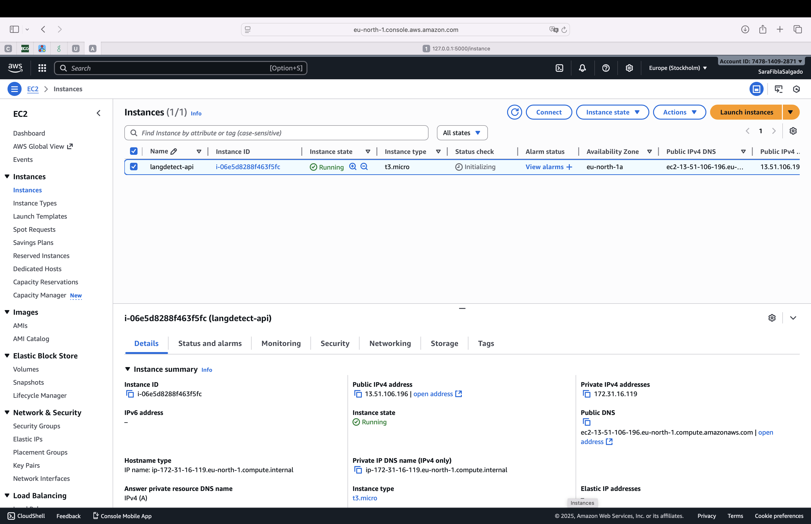

# CC_Assignment2 — Condensed Report

Date: 2025-11-01

Summary
This condensed report documents the three exercises for CC_Assignment2 and references included EC2 screenshots.

**Exercise 1 — MyApp (language detection)**
- Purpose: Flask microservice that detects language using langdetect.
- Key files: MyApp/langdetectSara.py, MyApp/index.html, MyApp/curl.zsh
- Run: create venv, install requirements, then:
  python MyApp/langdetectSara.py
  Open http://127.0.0.1:5000/ or use curl.zsh examples.
- Endpoints: /detect (top language), /detect_probs (candidates), /is_language (match check).

**Exercise 2 — EC2 screenshots**
- Add screenshots to: MyApp/docs/screenshots/
  - Image2.png — EC2 instances list (shows instance name, id, public IP)
  - Image1.png — service response page (instance id)
- Observations:
  - Instance name: langdetect-api, ID: i-06e5d8288f463f5fc
  - Public IPv4: 13.51.106.196
  - The service returned the instance id at the /instance endpoint, confirming reachability and metadata usage.

Markdown to include images in README:

**Exercise 3 — MyApp2 (Monthly Expense Tracker)**
- Purpose: Minimal Flask expense tracker with CSV import/export.
- Key files: MyApp2/app.py, MyApp2/templates/index.html, MyApp2/static/js/main.js, MyApp2/test_import.csv
- Run:
  python3 -m venv .venv
  source .venv/bin/activate
  pip install -r MyApp2/requirements.txt
  python MyApp2/app.py
  Open http://127.0.0.1:5000
- Test CSV import using MyApp2/test_import.csv via the UI import control.
